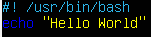
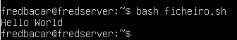
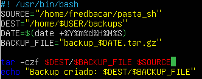
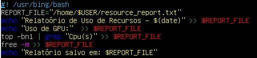
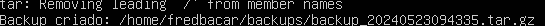
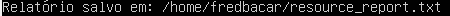
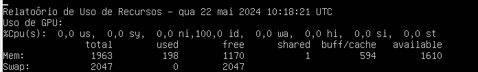

# Exercício 1

---

- 1º Criar um ficheiro para conter o script bash

```touch ficheiro.sh```

- 2º Abrir o ficheiro ``ficheiro.sh`` com nano executando o seguinte código:

``nano ficheiro.sh``

- 3º Escrever o seguinte código:



- 4º Para guardar o código fazer ``CTRL + O``, depois de fazer isso, fazer ``CTRL + X`` para sair do nano

- 5º Para fazer com que o script seja executável, fazer o seguinte comando:

``chmod u+x ficheiro.sh``

- 6º Por último, fazer o comando ``bash ficheiro.sh`` para verificar se está executável e deverá aparecer uma linha assim:




# Exercício 1 - Continuação

- 1º criar dois ficheiros:

``touch ficheiro1.sh``

``touch ficheiro2.sh``

- 2º Criar duas pastas, uma para o source e outra para o backup:

``mkdir pasta_sh``

``mdkir backups``

- 3º Depois da criação das duas pastas, abrir o ficheiro1.sh com o nano

``nano ficheiro1.sh``

- 4º Introduzir no ``ficheiro1.sh`` o seguinte código:



- 5º Depois de ser introduzido esse código e verificar que está certo, fazer ``CTRL + O`` para salvar e de seguida fazer ``CTRL + X`` para sair

- 6º Fazer com que o ``ficheiro1.sh`` seja executável com o seguinte código:

``chmod u+x ficheiro1.sh``

- 7º Agora, criar outro ficheiro com o código ``touch ficheiro2.sh``

- 8º Abrir o ``ficheiro2.sh`` com o nano, para isso fazer ``nano ficheiro2.sh``

- 9º Introduzir o seguinte código no ``ficheiro2.sh``



- 10º Quando fizer isso, primeiro fazer o comando ``CTRL + O`` para salvar e de seguida fazer o comando ``CTRL + X`` para sair

- 11º Fazer com que o ``ficheiro2.sh`` seja executável, para isso fazer o seguinte comando ``chmod u+x ficheiro2.sh``

- 12º Verificar se o ``ficheiro1.sh`` está a funcionar, para isso fazer ``bash ficheiro1.sh``

- 13º Se aparecer isto é porque funcionou:



- 14º Para verificar se o ficheiro foi criado, entre na pasta backups com o seguinte comando: ``cd backups``, depois que entrar faça ``ls`` e se aparecer o ficheiro em vermelho é porque foi criado com sucesso

- 15º Fazer ``cd ..`` até voltar à página inicial

- 16º Criar um ficheiro de texto para o ``ficheiro2.sh`` funcionar com o seguinte código, ``touch resource_report.txt``

- 17º Fazer com que o ``ficheiro2.sh`` seja executável, para isso fazer o comando ``chmod u+x ficheiro2.sh``

- 18º Verificar se o ``ficheiro2.sh`` está a funcionar, para isso fazer o seguinte comando: ``bash ficheiro2.sh`` e se aparecer isto é porque funcionou com sucesso



19º Para ver se escreveu tudo bem, executar o comando ``nano resource_report.txt`` para ver se aparece isto aqui:




